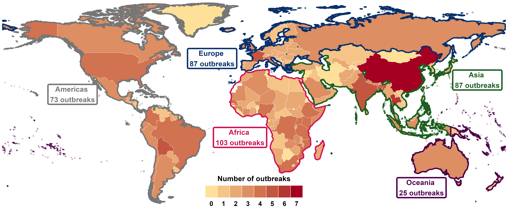
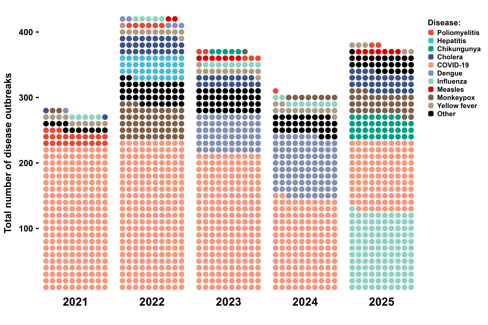
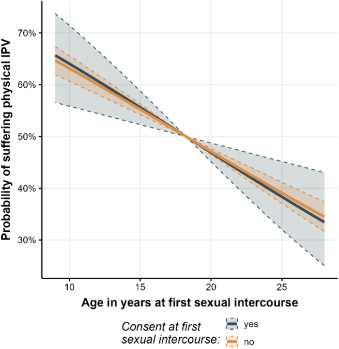
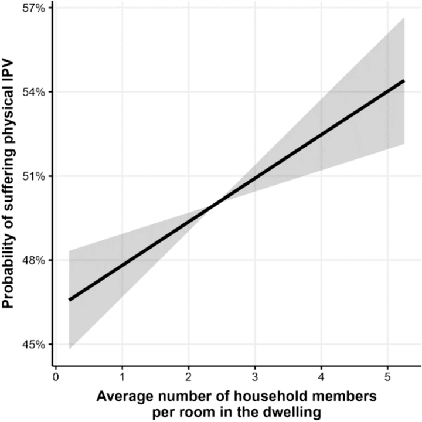
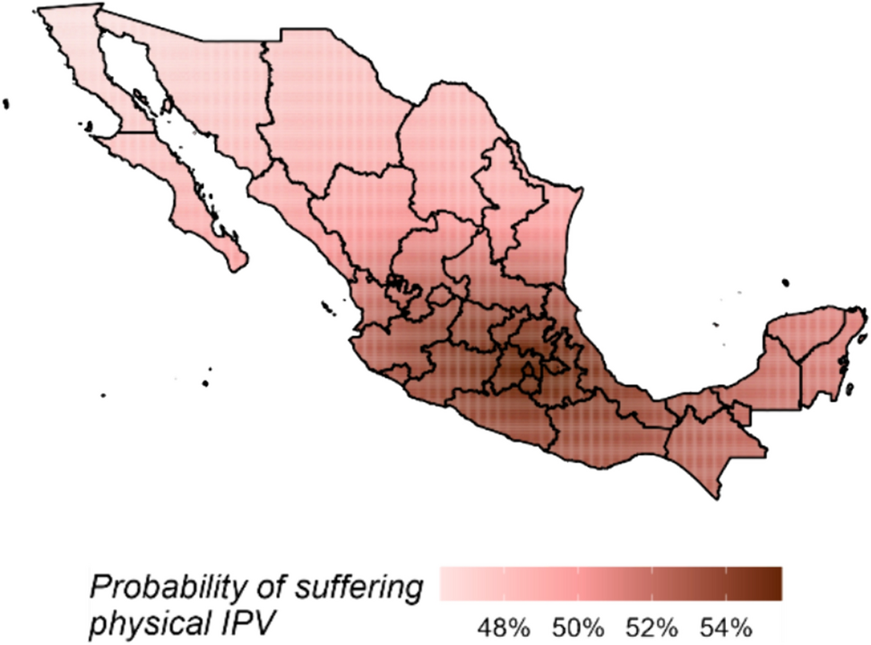

```{r}
line_1 <- "Risk factors for crime and **gender-based** violence victimization"
line_2 <- "Individual-, community-, and regional-level **correlates of poverty**"
line_3 <- "**Insights and forecasts** for **humanitarian emergencies**"
```

## ACADEMIC BACKGROUND
::: {.incremental}
- **Bachelor of Economics**, Universidad Autónoma de Coahuila. 

- **Master in Applied Statistics**, Instituto Tecnológico y de Estudios Superiores de Monterrey. 

- **PhD in Applied Statistics and Empirical Methods**, Georg-August-Universität Göttingen. **PhD dissertation:** "Essays on structured additive regression models with applications in development economics" _(summa cum laude)_.

:::

## PROFESSIONAL EXPERIENCE

**Norwegian Refugee Council:** 

- Forced displacement due to armed conflict in Sudan.

- Socio-economic impacts of disaster displacement in Bangladesh, Nigeria, Guatemala, and Kenya.

## PROFESSIONAL EXPERIENCE

**Norwegian Refugee Council:** 

- Forced displacement due to armed conflict in Sudan.

- Socio-economic impacts of disaster displacement in Bangladesh, Nigeria, Guatemala, and Kenya.

**United Nations Institute for Disarmament Research:** 

- Social, economic, and health impacts of armed conflict in Nigeria, Niger, Chad, Cameroon, Iraq, and Colombia.

- Return and reintegration of families following the ISIL conflict in Iraq.

- Child recruitment by Boko Haram in Nigeria.

- Firearm possession among civilians in Nigeria.

## PROFESSIONAL EXPERIENCE (continuation)

**United Nations Office on Drugs and Crime:** 

- Crime and violence victimization in Latin America and the Caribbean. 

## PROFESSIONAL EXPERIENCE (continuation)

**United Nations Office on Drugs and Crime:** 

- Crime and violence victimization in Latin America and the Caribbean. 

**UN Women:** 

- Geospatial analysis of gender-based violence against women and girls.

## PROFESSIONAL EXPERIENCE (continuation)

**United Nations Office on Drugs and Crime:** 

- Crime and violence victimization in Latin America and the Caribbean. 

**UN Women:** 

- Geospatial analysis of gender-based violence against women and girls.

**UN Migration:** 

- Migration governance in  Central America, North America, and the Caribbean.

## RESEARCH AGENDA
Broadly speaking, the goal of my academic work is to provide scientific evidence to better understand _how **individuals**, **families**, and **communities** experience, adapt to, and cope with humanitarian- and development-related phenomena_ such as armed conflict, violence, climate change, poverty, and forced displacement. To address this question, I integrate **statistical methods**, **machine learning algorithms**, and **data science techniques**.

<br>

## RESEARCH AGENDA
Broadly speaking, the goal of my academic work is to provide scientific evidence to better understand _how **individuals**, **families**, and **communities** experience, adapt to, and cope with humanitarian- and development-related phenomena_ such as armed conflict, violence, climate change, poverty, and forced displacement. To address this question, I integrate **statistical methods**, **machine learning algorithms**, and **data science techniques**.

<br>

**Specific lines of research:**

1. `r line_1`.

2. `r line_2` (income, food insecurity, energy poverty, etc.).

3. `r line_3` (armed conflict, disease outbreaks, forced displacement, etc.).

## 
#### `r line_1`.

<br>

- **OBJECTIVE:** To identify and describe how factors from the ecological model relate to crime and violence victimization, with a focus on the most vulnerable groups (women and girls).

## 
#### `r line_1`.

<br>

- **OBJECTIVE:** To identify and describe how factors from the ecological model relate to crime and violence victimization, with a focus on the most vulnerable groups (women and girls).

- **OUTPUTS:** 
**(1)** Three peer-reviewed papers (_J. of Gender-Based Violence_, _J. of Computational Social Science_, and _J. of interpersonal violence_). **(2)** Two working papers (_Ibero-America Institute for Economic Research_ and _Inter-American Development Bank_)

## 
#### `r line_1`.

<br>

- **OBJECTIVE:** To identify and describe how factors from the ecological model relate to crime and violence victimization, with a focus on the most vulnerable groups (women and girls).

- **OUTPUTS:** 
**(1)** Three peer-reviewed papers (_J. of Gender-Based Violence_, _J. of Computational Social Science_, and _J. of Interpersonal Violence_). **(2)** Two working papers (_Ibero-America Institute for Economic Research_ and _Inter-American Development Bank_)

- **IMPACT:** 
**(1)** Over 100 citations. **(2)** Supervision of two Master's theses at the Universidad Autónoma de Nuevo León and Ludwig-Maximilians-Universität München.

## 
#### `r line_2`.
<br>

- **OBJECTIVE:** To assess how a set of conditions shape patterns of poverty, with particular emphasis on the extreme poor.

## 
#### `r line_2`.
<br>

- **OBJECTIVE:** To assess how a set of conditions shape patterns of poverty, with particular emphasis on the extreme poor.

- **OUTPUTS:** 
**(1)** Three peer-reviewed papers (_J. of Applied Economics_, _Social Sciences_, and _PloS one_). **(2)** Two working papers (_Ibero-America Institute for Economic Research_)

## 
#### `r line_2`.
<br>

- **OBJECTIVE:** To assess how a set of conditions shape patterns of poverty, with particular emphasis on the extreme poor.

- **OUTPUTS:** 
**(1)** Three peer-reviewed papers (_J. of Applied Economics_, _Social Sciences_, and _PloS one_). **(2)** Two working papers (_Ibero-America Institute for Economic Research_)

- **IMPACT:** 
**(1)** Over 10 citations. **(2)** Cited in the _Regional Human Development Report 2025_ by UNDP.

##
#### `r line_3`.
<br>

- **OBJECTIVE:** To identify whether, how, where, and when humanitarian emergencies have occurred and may occur in the future.

##
#### `r line_3`.
<br>

- **OBJECTIVE:** To identify whether, how, where, and when humanitarian emergencies have occurred and may occur in the future.

- **OUTPUTS:** 
**(1)** Four peer-reviewed papers (_Frontiers in Climate_, _Scientific data_, _BMC public health_, and _BMJ_). **(2)** Six working papers (_UNIDIR_, and _UNU_).

##
#### `r line_3`.
<br>

- **OBJECTIVE:** To identify _whether_, _how_, _where_, and _when_ humanitarian emergencies have occurred and may occur in the future.

- **OUTPUTS:** 
**(1)** Four peer-reviewed papers (_Frontiers in Climate_, _Scientific data_, _BMC public health_, and _BMJ_). **(2)** Six working papers (_UNIDIR_, and _UNU_).

- **IMPACT:** 
**(1)** Over 60 citations. **(2)** 2023 ENLIGHT Open Science Award and was a finalist for the Falling Walls Science Breakthroughs. **(3)** UNOCHA's Humanitarian Data Exchange initiative. **(4)** Scientific and Technical Advisory Group of the Emergency Events Database (EM-DAT). **(5)** Cited in the _The Future of Peacekeeping: New Models and Related Capabilities_ (UN), _Preparedness for Epidemics and Pandemics_ (World Bank), and _Climate Risk Toolbox_ (FAO).

# Research on pandemic- and epidemic-prone disease outbreaks

## 
#### Research on pandemic- and epidemic-prone disease outbreaks
<br>

**A collaborative project of:**

:::: {.columns}

::: {.column width="33%"}
{width="100%"}
:::

::: {.column width="33%"}
{width="70%"}
:::

::: {.column width="33%"}
{width="70%"}
:::

::::

The project was made possible through financial support from the **ENLIGHT network**, the **German Academic Exchange Service (DAAD)**, and the **Federal Ministry of Education and Research (BMBF)** in Germany.

## 
#### Research on pandemic- and epidemic-prone disease outbreaks
<br>

**GOAL:** To **create a database containing all events with epidemic or pandemic potential to escalate into health crises**, enabling the analysis of three core questions: _when disease outbreaks occur_, _which diseases drive them_, and _where these events occur_.

## 
#### Research on pandemic- and epidemic-prone disease outbreaks
<br>

**GOAL:** To **create a database containing all events with epidemic or pandemic potential to escalate into health crises**, enabling the analysis of three core questions: _when disease outbreaks occur_, _which diseases drive them_, and _where these events occur_.

<br>

To create this, I employed a three-step methodology:

:::: {.columns style="text-align: center;"}

::: {.column width="33%"}
**Data collection**  

<i class="fa-solid fa-database" style="font-size:120px;"></i>
:::

::: {.column width="33%"}
**Data processing**  

<i class="fa-solid fa-gears" style="font-size:120px;"></i>
:::

::: {.column width="33%"}
**Data analysis**  

<i class="fa-solid fa-bacteria" style="font-size:120px;"></i>
:::

::::

## 
#### Data collection
<br>
Information was sourced from the WHO Disease Outbreak News (DONs) via web scraping using the `RSelenium` package in R.

::: {.panel-tabset}

#### Ebola--Gabon, 1996

<iframe src="pages_outbreaks/1996 - Ebola haemorrhagic fever in Gabon (new outbreak) - .html" style="width:100%; height:500px;"></iframe>

:::

## 
#### Data processing
<br>

I created a code in <i class="fa-brands fa-r-project"></i> to transform unstructured information into a database by:

:::: {.columns style="text-align: center;"}

::: {.column width="33%"}
**Text mining and language processing**  

<i class="fa-solid fa-language" style="font-size:120px;"></i>
:::

::: {.column width="33%"}
**Entity extraction (country, disease, year)**  

<i class="fa-solid fa-list-check" style="font-size:120px;"></i>
:::

::: {.column width="33%"}
**Harmonization to international standards**  

<i class="fa-solid fa-link" style="font-size:120px;"></i>
:::

::::

## 
#### Data analysis
<br>

The last version of the dataset was updated in February 2026 and contains information on **3501 outbreaks**, associated with **91 pathogens** that occurred since January 1996 in **236 countries and territories worldwide**.

- **Sub-Saharan Africa bears the highest burden of disease outbreaks**, with a clear spatial cluster around the Democratic Republic of the Congo.

- Following the COVID-19 pandemic, multiple diseases have emerged or re-emerged, including vaccine-preventable diseases and pathogens that had previously been largely controlled or eliminated. **There is a shift toward vector-borne and waterborne transmission pathways.**

## 
#### Data analysis
<br>

**Geographic distribution of disease outbreaks in 2025**

{fig-align="center" style="width:100%; max-width:none;"}

## 
#### Data analysis
<br>

**Disease outbreaks in the world, 2021-2025**

{fig-align="center" style="width:100%; max-width:none;"}

# A computational approach to gender-based violence

## 
#### A computational approach to gender-based violence

<br>

**GOAL:** To identify and describe the extent to which a comprehensive set of **risk factors from the ecological model** are associated with **physical intimate partner violence** (IPV) victimization in Mexico

<br>

To achieve this goal I employed a three-step methodology:

:::: {.columns style="text-align: center;"}

::: {.column width="33%"}
**Data collection**  <br>

<i class="fa-solid fa-database" style="font-size:120px;"></i>
:::

::: {.column width="33%"}
**Model building, fitting, and assessment**  

<i class="fa-solid fa-laptop-code" style="font-size:120px;"></i>
:::

::: {.column width="33%"}
**Findings**  <br>

<i class="fa-solid fa-person-harassing" style="font-size:120px;"></i>
:::

::::

## 
#### Data collection
<br>
Dataset of 35,000 observations and 42 theoretical correlates from 10 data sources was created, covering four levels of the ecological model:

::: {.panel-tabset}

#### Individual
- Caracteristics of the woman: age, income, education, age at her first sexual intercourse, etc.

- Caracteristics of the woman's partner: age, income, education, etc.

#### Relationship
- Age of the woman at marriage or at cohabitation.

- Woman's level of autonomy in the context of the relationship.

- Average number of household members per room in the dwelling.

- Division of housework among household members.

#### Community

- Level of social marginalization. 

- Type of community (rural, urban).

- Share of women-headed households.

- Homicides against women.

- Migration.

#### Regional

- Quality of government.

- Quality of public services.

- Perception of corruption.

:::

## 
#### Model building, fitting, and assessment
<br>

**Binomial response variable**, indicating **whether a woman experienced physical violence within an intimate relationship in the past 12 months**.

**Predictors include:** 

- Parametric effects for categorical variables.  
- Both linear and nonlinear effects for continuous variables.  
- Spatial effects.  
- Interaction effects.  
- Random effects.  

All these components are specified within a **structured additive regression (STAR) model**.

## 
#### Model building, fitting, and assessment
<br>

Due to its **high dimensionality and complex structure**, a three-step strategy is used to estimate the STAR model:

::: {.panel-tabset}

#### Boosting algorithm
- It **combines estimation with simultaneous variable selection and model choice** by iteratively selecting the best-fitting effect at each step. 

- To ensure unbiased variable selection and model choice, one degree of freedom is assigned to each candidate effect (e.g. linear vs. nonlinear).

- To avoid overfitting, cross-validation is used to determine the optimal number of iterations, mitigating multicollinerity.

- The boosting algorithm yields the best predictive model, retaining only relevant predictors in their most appropriate functional form.

#### Stability selection
- To avoid selecting non-relevant variables, subsampling generates multiple random subsets, and the boosting algorithm controls the error rate while selecting predictors.

- The relative selection frequency for each effect is computed across subsets; effects exceeding a predefined threshold are retained as stable.

- The result is a parsimonious model including only stable factors (non-zero coefficients).

#### Confidence intervals
- Finally, 95% confidence intervals for the subset of effects selected as stable are calculated by drawing 1000 random samples from the empirical distribution of the data using a bootstrap approach based on pointwise quantiles.

:::

## 
#### Findings
<br>

**Physical IPV victimization risk and women’s age at first sexual intercourse by consent.**

:::: {.columns}

::: {.column width="50%"}

- Women who initiate sex during childhood are a particularly vulnerable population to physical IPV in Mexico.

:::

::: {.column width="50%"}

{fig-align="center" style="width:90%; max-width:none;"}

:::

::::

## 
#### Findings
<br>

**Physical IPV victimization risk and average number of household members per room in the dwelling.**

:::: {.columns}

::: {.column width="50%"}

- As the number of household members grows, the likelihood of suffering from physical violence in the context of intimate relationships increases at a rate of 1.6 percentage points per member per room in the dwelling.

:::

::: {.column width="50%"}

{fig-align="center" style="width:90%; max-width:none;"}

:::

::::

## 
#### Findings
<br>

**Spatial effects of physical IPV victimization risk.**

:::: {.columns}

::: {.column width="50%"}

- Women and girls living in municipalities located in the central region of Mexico are on average more likely to suffer from physical violence perpetrated by their partner than women living in other regions.

:::

::: {.column width="50%"}

{fig-align="center" style="width:90%; max-width:none;"}

:::

::::

##
#### Papers in this presentation:

**Research on pandemic- and epidemic-prone disease outbreaks**

- Torres Munguía JA, _et al_ (2022) _A global dataset of pandemic- and epidemic-prone disease outbreaks_. **Nature Scientific Data** 9, 683. DOI: [10.1038/s41597-022-01797-2](https://doi.org/10.1038/s41597-022-01797-2).

- Torres Munguía JA, Martínez-Zarzoso I. (2026) _Global trends of pandemic-prone and epidemic-prone disease outbreaks in 2024_. **BMJ Global Health**. DOI: [10.1136/bmjgh-2025-020708](https://doi.org/10.1136/bmjgh-2025-020708)

**A computational approach to gender-based violence**

- Torres Munguía, JA (2024) _A model-based boosting approach to risk factors for physical intimate partner violence against women and girls in Mexico_. **Journal of Computational Social Science** 7, 1937–1963 . DOI: [10.1007/s42001-024-00292-5](https://doi.org/10.1007/s42001-024-00292-5)


# THANK YOU! {background-color="#0039a6"}
<br><br>

:::: {.columns}
::: {.column width="20%"}
:::

::: {.column width="45%"}
<span style="font-size:0.90em;">To learn more about me and my work,
please scan or visit my website</span>
:::

::: {.column width="35%"}
<div style="text-align:center;">
{width="50%"}
</div>

<div style="text-align:center;">
<a href="https://juan-torresmunguia.netlify.app"
   style="font-size:0.70em; font-weight:600;">
   juan-torresmunguia.netlify.app
</a>
</div>
:::
::::
